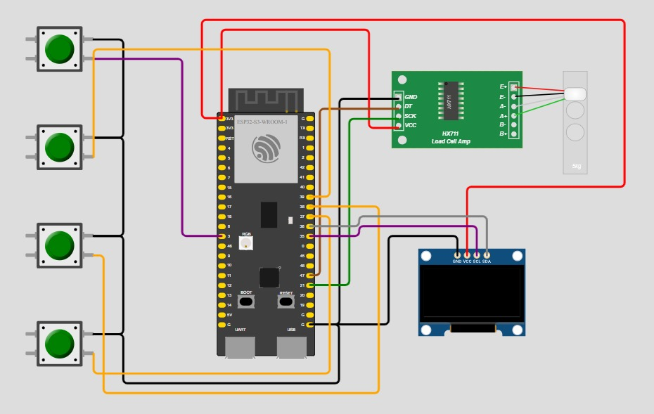

# Firmware, Server & Application Instructions
## Firmware Connection Diagram


## Server Instructions

### Running the Server

To run the server, follow these steps:

1. **Pull the Git Repository:**
    ```bash
    git pull
    ```

2. **Change Directory to the Server Folder:**
    ```bash
    cd server
    ```

3. **Install Required Python Packages:**
    ```bash
    pip install -r requirements.txt
    ```

4. **Run the Main Script:**
    ```bash
    python main.py
    ```

### Accessing the Server

To access the server, follow these steps:

1. **On Windows:**
    - Run the following command to find your IPv4 address:
      ```bash
      ipconfig
      ```
    - Look for the IPv4 address of your network (probably the WiFi).

2. **Ensure Network Connection:**
    - Make sure you are on the same network as the server.

3. **Use the IPv4 Address as the Endpoint:**
    - The server runs on port `8045`. You can edit this port in `main.py` in the server directory.
    - Example URL:
      ```bash
      http://192.168.167.251:8045/
      ```

## Application Instructions

### Running the Application

To run the application, follow these steps:

1. **Update Base URL:**
    1. Open the file located at `eat_smart/lib/constants.dart`.
    2. Change the `baseUrl` variable to the URL you found earlier.

2. **Run the Server:**
    - Ensure the server is running before proceeding to the next steps.

3. **Set Up Android Emulator:**
    1. Open **Android Studio**.
    2. Set up your favorite emulator. We recommend using **Nexus API 30** as it has proven to be the most stable.
    3. Under "Device Manager", press the play button to start the emulator.

4. **Run the Application:**
    1. Open **Visual Studio Code**.
    2. Navigate to `lib/main.dart`.
    3. Press the play button (or use `F5`) to run the application.

### Additional Notes

- Make sure all dependencies are installed and configured properly.
